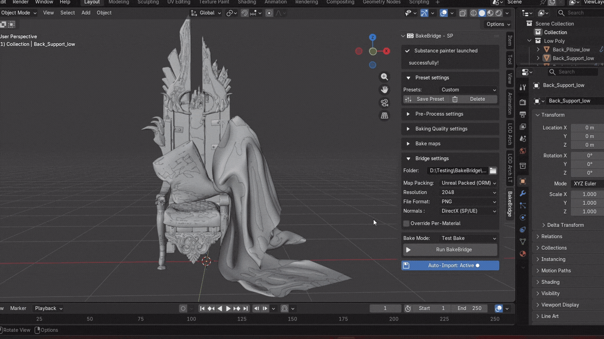
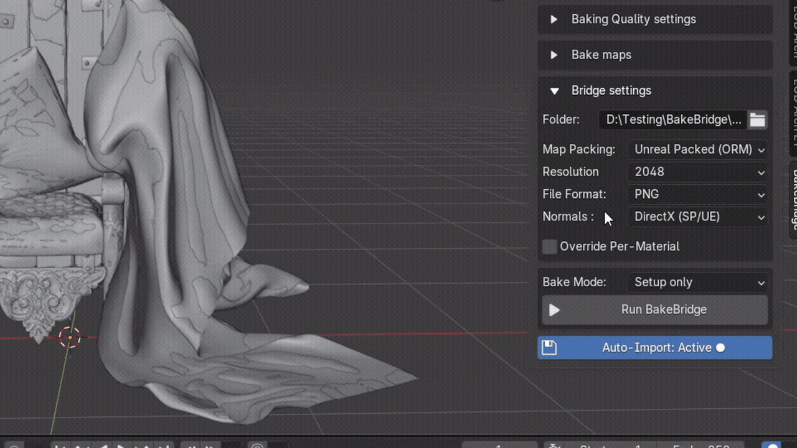

# BakeBridge

An automated, pipeline-friendly bidirectional bridge connecting **Blender** and **Substance Painter**. Stop exporting meshes, configuring bakers, and wiring shader nodes one-by-one; BakeBridge automates your entire texturing loop in a single click.

 

---

## Demo

*(Click the banner above to watch the YouTube demo video!)*

---

## Key Features

* 🚀 **One-Click Pipeline**: Auto-saves your active Blender scene, cleans up your geometry, exports FBX files, and boots up Substance Painter instantly.
* 🛠️ **Geometry Pre-Processing**: Cleans up meshes dynamically by merging double vertices, fixing inverted normals, applying smooth shading, and adding a non-destructive Triangulate modifier. Run it manually to inspect your model, or let the exporter handle it automatically.
* 🎛️ **Three Baking Modes**: Choose **Setup Only** to configure project templates, **Test Bake** to run speed-optimized bakes (auto-lowered resolution, no anti-aliasing), or **Full Quality** for final anti-aliased bakes.
* 💾 **Custom Preset System**: Configure your preferred export formats, normal map spaces, and baking settings once, and save them as reusable presets (e.g., Stylized, Realistic).
* 📏 **Per-Material Overrides**: Customize texture sizes per material slot in Blender (e.g. 2K for accessories, 4K for the main body) and Substance Painter will automatically export them at their correct sizes.
* 🔌 **Background Watcher & Shader Auto-Wire**: An automatic file listener detects your exports, automatically imports sRGB and Non-Color maps, and wires them into the Principled BSDF node in Blender.

> [!NOTE]
> BakeBridge is architected to be fully compatible with **Windows, macOS, and Linux**. However, because I currently only own Windows hardware, it has only been actively tested on **Windows**. If you run into any issues on macOS or Linux, please submit a bug report – resolving platform-specific bugs is a high priority for me.

---
---
## 📺 Feature Showcase
### 🚀 One-Click Export & Setup

*BakeBridge auto-saves your file, cleans up geometry, and boots up Substance Painter in a single click.*
### 📏 Per-Material Resolution Overrides

*Set different resolutions for individual materials in Blender, and let the bridge handle the export config automatically.*
### 🔌 Auto-Shader Setup (Auto-Wiring)

*Click the BB button in Substance Painter, and watch Blender instantly build the Principled BSDF node tree with correct color spaces.*
---

## 📖 Quick Links

* [**Installation Guide**](installation.md) – How to set up the Blender addon and the Substance Painter plugin.
* [**Quick Start Guide**](quick-start.md) – Your first bake: from Blender collections to Substance Painter and back.
* [**Troubleshooting & FAQ**](troubleshooting.md) – Fixes for common setup issues, file formats, and color management.

---

## 🐛 Support & Bug Reports

I track all bugs and feature requests directly in this repository. 

1. Go to the [**Issues**](../../issues) tab at the top of this page.
2. Click **New Issue**.
3. Describe the problem clearly, including your Blender and Substance Painter versions, and any console logs.

---

## 🔗 Marketplace Links

* [**Get BakeBridge SP on Superhive**](https://superhivemarket.com/products/bakebridge-sp)

