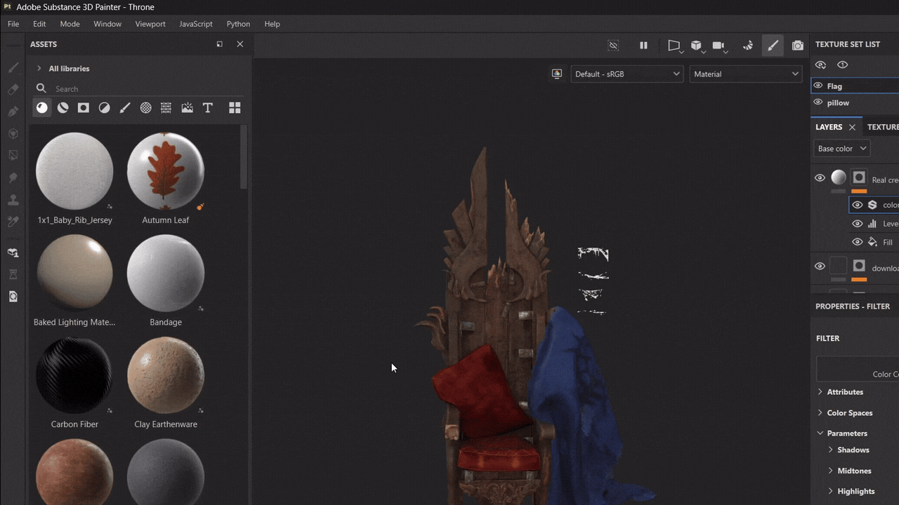

# Installation Guide

BakeBridge is packaged as a modern Blender Extension. This means it **only supports Blender 4.2 and above**. 

Setting up the bridge takes less than a minute. Here is the step-by-step process.

---

## Step 1: Install the Blender Addon

You can install the addon in two ways:

* **Way A: Drag and Drop (Easiest)**
  1. Simply drag the downloaded `BakeBridge - SP.zip` file directly from your file explorer and drop it anywhere into the Blender 3D viewport.
  2. Blender will automatically install and enable the extension.
* **Way B: Extensions Preferences**
  1. Open Blender and go to **Edit → Preferences → Get Extensions**.
  2. Click the arrow/menu icon in the top-right corner of the Preferences window and select **Install from Disk...**
  3. Select the `BakeBridge - SP.zip` file and click **Install**.

---

## Step 2: Configure BakeBridge Settings

In Blender, go to **Edit → Preferences → Add-ons** and locate **BakeBridge - SP**. Expand the addon preferences details to configure these two paths:

* **Plugin Directory (Auto-Detected)**
  1. BakeBridge automatically scans your Documents folder for the Substance Painter plugins directory and installs the plugin files for you.
  2. If this field is empty, your plugins folder is in a custom location – click the folder icon to select it manually and click **Install Plugin**.
* **Substance Painter Executable (Manual)**
  1. Because Substance Painter can be installed on any drive, BakeBridge cannot scan for it automatically.
  2. Click the folder icon next to the **Substance Painter Exe** field and browse to your `Adobe Substance 3D Painter.exe` directly.

---

## Step 3: Activate the Plugin in Substance Painter

Before the bridge can process commands, you must enable the plugin inside Substance Painter. You can do this in two ways:

* **Way A: Via the Bridge**
  1. In the Blender sidebar panel, click **Run BakeBridge**. This will open Substance Painter.
  2. Go to the top menu bar in Substance Painter and select **Python**.
  3. Locate **`bakebridge_sp`** in the list and click it to place a checkmark next to it.
  4. The custom **BB** logo button will appear, and the project setup or bake will automatically execute.
* **Way B: Manually**
  1. Simply open **Substance Painter** manually from your desktop or launcher.
  2. Go to the top menu bar and select **Python**.
  3. Locate **`bakebridge_sp`** in the list and click it to place a checkmark next to it.
  4. The custom **BB** logo button will appear on your toolbar.

---

You're all set up and ready to bake!
